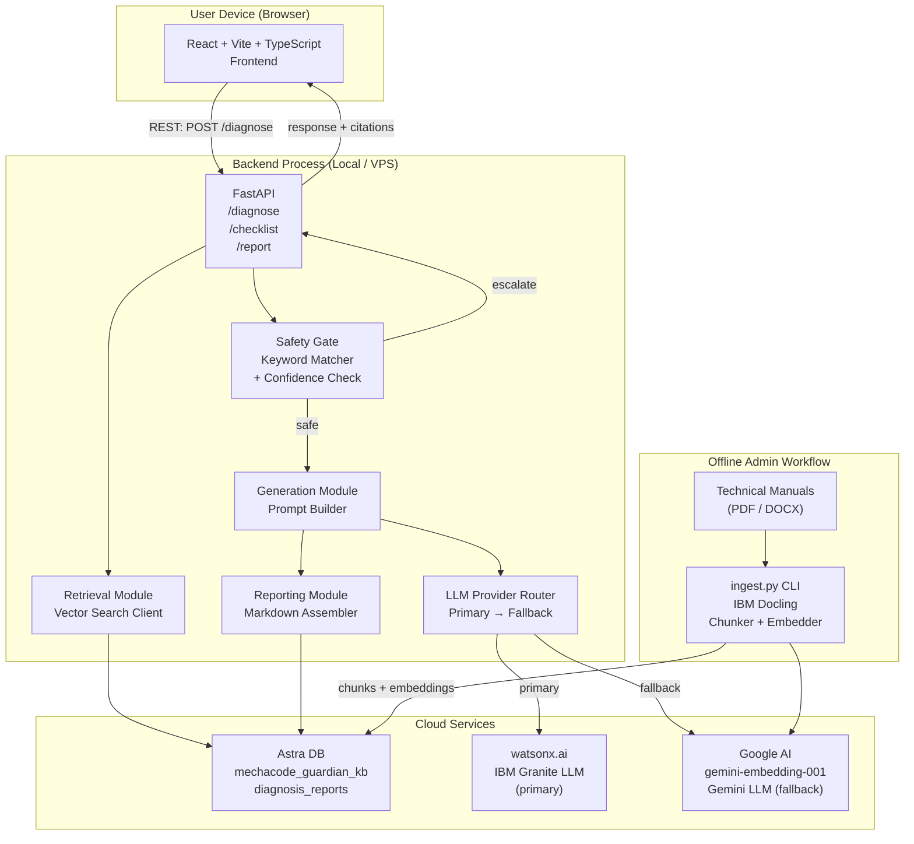

# Architecture Document — MechaCode Guardian

**Version:** 0.2
**Date:** 2025-07-20 (updated same day with resolved decisions)
**Status:** Design intent — no production code exists yet. Diagrams represent the intended target state for the MVP.

---

## Table of Contents

1. [System Components](#1-system-components)
2. [Architecture Diagram](#2-architecture-diagram)
3. [End-to-End Data Flow](#3-end-to-end-data-flow)
4. [RAG Pipeline](#4-rag-pipeline)
5. [Evidence and Citation Strategy](#5-evidence-and-citation-strategy)
6. [Safety Gate](#6-safety-gate)
7. [Confidence and Escalation Logic](#7-confidence-and-escalation-logic)
8. [Technology Decisions](#8-technology-decisions)
9. [Deployment Design](#9-deployment-design)
10. [Security Controls](#10-security-controls)
11. [Scalability Path](#11-scalability-path)
12. [Open Architecture Decisions](#12-open-architecture-decisions)

---

## 1. System Components

### 1.1 Frontend — `frontend/`
- **Technology:** React 18 + Vite + TypeScript
- **Responsibility:** Symptom input form, diagnosis output, checklist interaction, escalation notice, report download.
- **State management:** React Context or Zustand (lightweight; decision deferred — see Section 12).
- **Communication:** REST calls to the FastAPI backend over HTTP. No direct calls to external AI services.
- **Bilingual UI:** `react-i18next` for static strings. Dynamic LLM output language follows server response.

### 1.2 Backend — `backend/`
- **Technology:** FastAPI (Python 3.11+), Uvicorn, Pydantic v2
- **Structure:** Modular monolith. Each concern is a Python package:

| Package | Responsibility |
|---|---|
| `backend/api/` | FastAPI routers, request/response schemas |
| `backend/ingestion/` | Docling-based document parsing and chunking |
| `backend/retrieval/` | Astra DB vector search client |
| `backend/generation/` | LLM provider abstraction, prompt templates |
| `backend/safety/` | Safety gate evaluation, escalation trigger matching |
| `backend/reporting/` | Diagnosis report assembly and Markdown export |
| `backend/core/` | Shared config, logging, session management |

### 1.3 Vector Store — Astra DB (DataStax)
- **Technology:** DataStax Astra DB (cloud-managed Apache Cassandra with vector search extension)
- **Collections:**
  - `mechacode_guardian_kb` — embedding vectors (3072-dim, cosine) + metadata (source, page/section, language, provenance, hash). **This is the sole knowledge-base collection; the capstone collection is not modified.**
  - `diagnosis_reports` — persisted session reports (JSON)
- **Access:** Python client (`astrapy`) from the backend.
- **Why Astra DB:** Serverless, free tier available, native vector search, no self-hosted infrastructure required on developer hardware. Explicitly permitted supporting technology under competition rules.

### 1.4 Document Ingestion CLI — `scripts/ingest.py`
- **Technology:** IBM Docling for parsing; custom chunking logic; Astra DB writer.
- **Run mode:** Offline / admin-only. Not part of the live request path.
- **Input:** PDF or DOCX files placed in a watched directory.
- **Output:** Chunks embedded and written to Astra DB `document_chunks` collection.

### 1.5 LLM Provider Abstraction — `backend/generation/providers/`
- **Primary:** IBM Granite Instruct via `ibm-watsonx-ai` Python SDK, hosted on watsonx.ai.
- **Fallback:** Gemini (developer's existing Google AI access) via `google-generativeai` Python SDK.
- **Interface contract:**
```python
class LLMProvider(Protocol):
    async def generate(self, prompt: str, max_tokens: int, temperature: float) -> LLMResponse:
        ...
```
- **Routing:** `ProviderRouter` tries primary; on `ProviderError` or timeout, retries the Gemini fallback and emits a `FALLBACK_USED` log event.
- **Competition note:** Both IBM Granite (primary) and Gemini (fallback) are permitted technologies under the July Wildcard Challenge rules.

### 1.6 Embedding Layer
- **Model (resolved — UD-03):** `gemini-embedding-001` via Google AI API.
- **Output dimensionality:** 3072 (fixed).
- **Task types:**
  - Ingestion: `task_type="RETRIEVAL_DOCUMENT"`
  - Query: `task_type="RETRIEVAL_QUERY"`
- **Normalisation:** vectors normalised before storage; cosine similarity used in Astra DB ANN search.
- **The same model, dimensionality, normalisation, and task configuration must be used for both ingestion and querying.** Mixing configurations will produce incorrect similarity scores.
- **Bilingual capability:** `gemini-embedding-001` handles both Bahasa Indonesia and English tokens. No query translation step is required.
- **Implementation:** `backend/ingestion/embedder.py` and `backend/retrieval/embedder.py` both reference a shared `EmbeddingConfig` constant to enforce consistency.

---

## 2. Architecture Diagram



> **Note:** This diagram reflects the intended design. No production code has been written yet.

---

## 3. End-to-End Data Flow

### 3.1 Diagnosis Request (Happy Path)

```
Step 1  [Frontend]
        User submits: {equipment_type, manufacturer, model, alarm_code, symptom_text, language}
        → POST /api/v1/diagnose

Step 2  [API Layer]
        Validate request schema (Pydantic)
        Generate anonymous session_id (UUID4)
        Detect input language (langdetect or fastText micro-library)

Step 3  [Retrieval Module]
        Embed symptom_text using gemini-embedding-001 (task: RETRIEVAL_QUERY, dim: 3072)
        Query Astra DB collection mechacode_guardian_kb with ANN cosine search (top-K=7)
        Return: List[Chunk{text, source_doc, page, section, score}]

Step 4  [Safety Gate — first pass]
        Scan symptom_text + top-K chunk texts for safety-trigger patterns
        If trigger detected → return EscalationResponse immediately (skip Steps 5–6)
        Evaluate top similarity score against three-tier retrieval policy:
          score < 0.55  → SR-06 refusal (no diagnosis)
          0.55 ≤ score < 0.68 → generate with escalation/clarification flag
          score ≥ 0.68  → proceed normally

Step 5  [Generation Module]
        Build RAG prompt (see Section 4)
        Call LLM via ProviderRouter
        Parse structured response: {causes: [...], confidence_band: str, checklist: [...]}

Step 6  [Safety Gate — second pass]
        Re-evaluate confidence_band
        If Low → override to EscalationResponse

Step 7  [API Layer]
        Assemble DiagnosisResponse:
            session_id, causes (ranked), evidence_chunks, confidence_band,
            checklist (if safe), escalation_flag, disclaimer_text

Step 8  [Frontend]
        Render causes with citations
        Render checklist OR escalation notice (mutually exclusive)

Step 9  [Reporting Module — on user request]
        User triggers "Generate Report"
        Assemble MarkdownReport from session data
        Persist to Astra DB diagnosis_reports
        Return Markdown blob for download
```

### 3.2 Error Cases

| Error | Behaviour |
|---|---|
| Primary LLM timeout/error | ProviderRouter retries on fallback; user sees normal response; log `FALLBACK_USED` |
| Fallback LLM also fails | Return a `503` with message: "AI service temporarily unavailable. Please consult the manual directly." |
| No relevant chunks found (all scores below threshold) | Return SR-06 refusal: "No matching documentation found. Consult official manual." |
| Safety trigger fires | Return escalation notice — no checklist, no causes displayed |
| Astra DB connection failure | Return `503` with diagnostic hint; do not expose connection string in error |

---

## 4. RAG Pipeline

### 4.1 Ingestion (Offline)

```
Source: knowledge/synthetic/ (original synthetic mechatronics documentation)
  - All documents are original content created for MechaCode Guardian
  - Each document carries a provenance label and synthetic-use declaration
  - No manufacturer manuals are ingested until redistribution rights are verified
        ↓
IBM Docling
  - Extracts structured text (respects table structure, headers, page breaks)
  - Preserves page/section hierarchy
        ↓
Chunker
  - Strategy: Sliding window with overlap (window=512 tokens, overlap=64 tokens)
  - Each chunk tagged: {doc_id, source_file, page_start, page_end, section_title, language,
                        provenance: "synthetic"}
        ↓
gemini-embedding-001
  - task_type = RETRIEVAL_DOCUMENT
  - output_dimensionality = 3072
  - normalise = True
  - Each chunk text → 3072-dimensional float vector
        ↓
Astra DB upsert
  - Collection: mechacode_guardian_kb   ← (capstone collection not touched)
  - Document: {id, vector, text, metadata}
```

> **Assumption A4:** Chunking at 512 tokens with 64-token overlap is a reasonable starting point for synthetic mechatronics documentation. This will be validated during evaluation against retrieval recall metrics. Chunk size may be adjusted down to 256 tokens if synthetic documents are shorter-form.

### 4.2 Query-Time Retrieval

```
User query + equipment context
        ↓
Language detection (langdetect)
        ↓
gemini-embedding-001
  - task_type = RETRIEVAL_QUERY
  - output_dimensionality = 3072
  - normalise = True
        ↓
Astra DB ANN vector search — collection: mechacode_guardian_kb
  - Metric: cosine similarity
  - top_k = 7 (configurable)
  - Optional metadata filter: equipment_category, language
        ↓
Three-tier score policy (provisional — calibrate against 30-case eval):
  - top score < 0.55       → SR-06 refusal: return "no evidence found"
  - 0.55 ≤ top score < 0.68 → proceed with clarification/escalation flag
  - top score ≥ 0.68       → proceed normally
        ↓
Re-ranking (optional, post-MVP)
  - Cross-encoder re-ranker for precision improvement
        ↓
Top-K chunks returned with scores
```

### 4.3 Prompt Construction

The RAG prompt follows this template structure (simplified):

```
SYSTEM:
You are MechaCode Guardian, an AI maintenance co-worker for mechatronics technicians.
Answer strictly in {language}. Ground every claim in the provided evidence.
Do not invent information. If evidence is insufficient, say so explicitly.

EVIDENCE:
[1] Source: {doc_name}, Page {page}, Section "{section}"
{chunk_text}

[2] Source: ...

QUERY:
Equipment: {equipment_type} — {manufacturer} {model}
Alarm code: {alarm_code}
Symptoms: {symptom_text}

INSTRUCTIONS:
1. List up to 3 probable causes, ranked by likelihood.
2. For each cause, cite the evidence item number (e.g., [1]).
3. Assign a confidence band: High / Medium / Low.
4. Generate a step-by-step inspection checklist for the most likely cause only.
5. Each checklist step must cite its evidence source.
6. If any step involves high-voltage, stored energy, hydraulics, or pressurised gas,
   mark it with SAFETY: <precaution>.
7. Output as structured JSON conforming to DiagnosisOutput schema.
```

> **Note on prompt engineering:** The exact prompt wording will be iterated during the evaluation phase. The above is an initial draft only.

---

## 5. Evidence and Citation Strategy

### 5.1 Citation Format (User-Facing)

Each cause and each checklist step displays a citation badge:

```
[Siemens SINUMERIK 840D, p. 47, §3.2 Drive Fault Codes]
```

Clicking the badge (post-MVP) would open the source document at the relevant page.

### 5.2 Citation Faithfulness Rules

- The LLM is instructed to reference evidence by its item number `[n]` in the prompt.
- The backend maps `[n]` back to the actual chunk metadata before returning to the frontend.
- If the LLM produces a reference number outside the range of provided evidence items, the backend MUST flag this as an anomaly, strip the fabricated citation, and label the statement as "unverified — no document source".
- Evaluation metric: citation faithfulness score (see EVALUATION_PLAN.md, EM-04).

### 5.3 No-Evidence Behaviour

If all retrieval scores fall below the configured minimum threshold (UD-02):
- Do NOT attempt generation.
- Return SR-06 refusal response.
- Log the event as `LOW_CONFIDENCE_REFUSAL` for evaluation tracking.

---

## 6. Safety Gate

The safety gate is a mandatory synchronous check that runs at two points in the pipeline (Steps 4 and 6 of Section 3.1). It is a pure Python function with no LLM dependency, making it fast and deterministic.

### 6.1 Trigger Sources

| Source | Check |
|---|---|
| Input keyword match | Regex match against safety_triggers.json (version-controlled list) |
| Retrieved chunk keyword match | Same regex match applied to all retrieved chunk texts |
| Confidence band | If LLM returns `Low` confidence |
| Missing evidence | If no chunks retrieved above threshold |

### 6.2 Trigger List Structure (safety_triggers.json)

```json
{
  "version": "1.0.0",
  "triggers": [
    { "pattern": "tegangan tinggi|high voltage|HV", "hazard_type": "electrical", "severity": "critical" },
    { "pattern": "arc flash|flash over|loncatan busur", "hazard_type": "electrical", "severity": "critical" },
    { "pattern": "stored energy|energi tersimpan", "hazard_type": "mechanical", "severity": "high" },
    { "pattern": "gas bocor|gas leak|kebocoran gas", "hazard_type": "chemical", "severity": "critical" },
    { "pattern": "tekanan hidraulik|hydraulic pressure", "hazard_type": "hydraulic", "severity": "high" }
  ]
}
```

> This is a representative sample. The production list must contain a minimum of 20 patterns (see FR-05.1).

### 6.3 Escalation Response Schema

```json
{
  "session_id": "uuid",
  "escalation_flag": true,
  "hazard_types": ["electrical"],
  "escalation_message": "⚠ Bahaya tegangan tinggi terdeteksi. Jangan lanjutkan tanpa teknisi listrik berlisensi.",
  "checklist": null,
  "causes": null,
  "disclaimer": "This is an AI-assisted recommendation. Always verify with qualified personnel."
}
```

---

## 7. Confidence and Escalation Logic

### 7.1 Confidence Band Derivation

Confidence is a composite of two signals:

| Signal | Weight (indicative) | Description |
|---|---|---|
| Retrieval score | 60% | Mean cosine similarity of top-3 retrieved chunks |
| LLM self-report | 40% | LLM asked to rate its own certainty (1–5 scale); mapped to band |

> **Assumption A5:** The 60/40 weighting is an initial estimate. It will be calibrated against the evaluation dataset. The exact formula may change.

Composite score → Band mapping:
- ≥ 0.75 → **High**
- 0.50–0.74 → **Medium**
- < 0.50 → **Low** → triggers escalation

### 7.2 Escalation Decision Tree

```
Is any safety-trigger keyword present in input or retrieved chunks?
  YES → ESCALATE (hazard type: from trigger metadata)
  NO  ↓
Is composite confidence band == Low?
  YES → ESCALATE (reason: insufficient evidence)
  NO  ↓
Were zero chunks retrieved above minimum score threshold?
  YES → REFUSE (SR-06 — no documentation found)
  NO  ↓
→ PROCEED to checklist generation
```

---

## 8. Technology Decisions

| Decision | Choice | Rationale | Alternatives Considered |
|---|---|---|---|
| Frontend framework | React + Vite + TypeScript | Standard, fast dev experience, strong TS ecosystem | Next.js (overkill for demo), Vue (less familiar) |
| Backend framework | FastAPI | Async, fast, Pydantic-native, Python ecosystem for AI libs | Django (heavier), Flask (less structured) |
| Vector store | Astra DB — collection `mechacode_guardian_kb` | Serverless, free tier, native vector, no infra management; competition-permitted technology | Qdrant (self-hosted), Weaviate, pgvector |
| Document parser | IBM Docling | IBM ecosystem alignment, strong PDF/DOCX structured extraction | PyMuPDF, pdfplumber (less structured output) |
| Primary LLM | IBM Granite (watsonx.ai) | Competition requirement; IBM Bob is the primary AI development partner | GPT-4o, Claude Sonnet |
| Fallback LLM | Gemini (Google AI) | Developer has existing access; competition-permitted; same API covers embeddings | Groq/llama-3 (rejected — adds new account/API), Ollama (rejected — GPU requirement) |
| Embedding model | `gemini-embedding-001` (3072-dim) | Multilingual (handles Indonesian + English natively); competition-permitted; consistent API with Gemini fallback LLM | ibm/slate (English-only), paraphrase-multilingual-MiniLM (lower dim, local dependency) |
| LLM calling | `ibm-watsonx-ai` SDK (primary), `google-generativeai` SDK (fallback) | Official SDKs for respective services | LangChain (heavier dependency, abstraction cost) |
| Knowledge base content | Original synthetic documentation (`knowledge/synthetic/`) | Copyright risk of manufacturer manuals eliminated; full control over content quality | Manufacturer PDFs (rejected — redistribution rights not verified) |
| Language detection | langdetect | Lightweight, no API call required | LLM-based detection (expensive) |
| Session ID | UUID4, anonymous | Privacy-preserving, no PII | — |
| Report format | Markdown | Portable, renderable, no heavy dependency | PDF (post-MVP) |
| Secrets management | Environment variables (.env, not committed) | Simple, standard | Vault (overkill for MVP) |

> **Deliberate non-decisions:** LangChain, LlamaIndex, and other orchestration frameworks are intentionally excluded from the MVP to reduce dependency surface, improve debugability, and keep the token-usage logic explicit and auditable.

---

## 9. Deployment Design

### 9.1 MVP Deployment (Local / Demo)

```
Developer Machine (Windows 11, i7 10th Gen, 16 GB RAM)
├── npm run dev          → Vite dev server (localhost:5173)
├── uvicorn backend.main:app --reload  → FastAPI (localhost:8000)
└── .env                → ASTRA_DB_TOKEN, WX_API_KEY, WX_PROJECT_ID,
                          GOOGLE_AI_API_KEY (not committed)

Cloud (external services, no local GPU required)
├── Astra DB Serverless  → vector store (collection: mechacode_guardian_kb)
├── watsonx.ai           → IBM Granite inference (primary LLM)
└── Google AI            → gemini-embedding-001 (embeddings) + Gemini (fallback LLM)
```

### 9.2 Demo/Competition Deployment

For the competition submission demo, the backend may be deployed to a low-cost VPS (e.g., Railway.app free tier, Render.com free tier) to avoid "runs only on my machine" issues.

> **Unresolved Decision UD-06:** Whether to deploy the backend to a free VPS or run it locally during the demo. Trade-offs: VPS = cold start latency, free tier limits; local = reliable but not publicly accessible.

### 9.3 Directory Structure (Intended)

```
mechacode-guardian/
├── frontend/               # React + Vite + TypeScript
│   ├── src/
│   │   ├── components/
│   │   ├── pages/
│   │   ├── api/            # API client functions
│   │   └── i18n/           # Translation files (id, en)
│   └── vite.config.ts
├── backend/
│   ├── api/                # FastAPI routers
│   ├── ingestion/          # IBM Docling chunker
│   ├── retrieval/          # Astra DB search client
│   ├── generation/         # LLM providers, prompt templates
│   ├── safety/             # Safety gate, trigger list
│   ├── reporting/          # Report assembler
│   └── core/               # Config, logging, models
├── scripts/
│   └── ingest.py           # CLI ingestion script
├── data/
│   └── safety_triggers.json  # Version-controlled trigger list
├── docs/                   # All planning documents
├── tests/
│   ├── unit/
│   ├── integration/
│   └── evaluation/         # 30-case evaluation dataset
├── .env.example            # Template — no real secrets
├── .gitignore
└── README.md
```

---

## 10. Security Controls

| Control | Implementation |
|---|---|
| No secrets in git | `.env` is in `.gitignore`; `.env.example` contains only placeholder values |
| API key rotation | Keys loaded from env vars at process start; rotation requires restart only |
| Input validation | Pydantic v2 models with strict field types and length limits on all API inputs |
| File upload validation | Document ingestion is admin-only CLI; validates MIME type and file size |
| Error message sanitisation | Backend never exposes internal stack traces, connection strings, or API keys in HTTP responses |
| CORS | FastAPI CORS middleware configured to allow only the known frontend origin |
| Session anonymity | Session IDs are UUID4; no user PII stored |
| Dependency scanning | `pip-audit` / `safety` check to be run before submission |
| Citation injection guard | Backend validates all LLM-referenced chunk IDs against the actual retrieved set before returning |

> **Out of scope for MVP:** Rate limiting, JWT authentication, HTTPS certificate (assumed handled by reverse proxy or VPS provider).

---

## 11. Scalability Path

This section records the intended growth path beyond the MVP. None of these are planned for the current competition submission.

| Stage | Change | Trigger |
|---|---|---|
| Post-MVP v1 | Add cross-encoder re-ranking step to improve retrieval precision | Evaluation shows Recall@5 is acceptable but MRR is poor |
| Post-MVP v1 | Add PDF report export | User demand |
| Post-MVP v2 | Add supervisor/safety officer dashboard | Enterprise pilot |
| Post-MVP v2 | Multimodal: accept image uploads for fault diagnosis | Equipment that displays fault visually |
| Scale-out | Replace Astra DB free tier with paid tier or self-hosted Cassandra vector | Document corpus > 10,000 chunks |
| Scale-out | Move backend to containerised deployment (Docker + Railway/Render) | Public availability |
| Long-term | Structured feedback loop to improve prompt templates and trigger lists | After 100+ real sessions |
| Long-term | Fine-tuning IBM Granite on domain-specific Indonesian mechatronics data | After data collection and ethics approval |

---

## 12. Architecture Decisions

### 12.1 Resolved Decisions

| ID | Decision | Resolved Value | Date |
|---|---|---|---|
| UD-01 | Fallback LLM provider | **Gemini** via `google-generativeai` SDK. Groq rejected (new account required); Ollama rejected (GPU dependency). | 2025-07-20 |
| UD-02 | Retrieval similarity thresholds | **< 0.55 = SR-06 refusal; 0.55–0.67 = escalate/clarify; ≥ 0.68 = proceed.** These are provisional — must be calibrated against the 30-case evaluation dataset. | 2025-07-20 |
| UD-03 | Embedding model | **`gemini-embedding-001`, 3072-dim, cosine, `RETRIEVAL_DOCUMENT`/`RETRIEVAL_QUERY` task types.** Consistent config mandatory for ingestion and query. | 2025-07-20 |
| UD-04 | Frontend state management | React Context for MVP (low shared-state complexity); Zustand if state grows post-MVP. | 2025-07-20 |
| UD-05 | Knowledge base content | **Original synthetic documentation** under `knowledge/synthetic/`. Manufacturer manuals blocked until redistribution rights verified. Capstone collection not modified. | 2025-07-20 |

### 12.2 Open Decisions

| ID | Decision | Options | Decision Criteria |
|---|---|---|---|
| UD-06 | Demo backend hosting | Local machine, Railway.app, Render.com | Accessibility, cold-start latency — decide by Day 8 |
